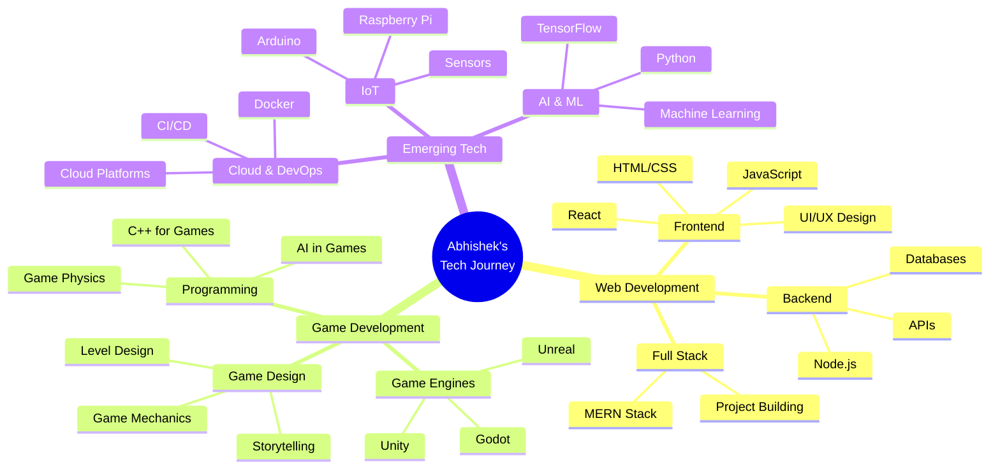
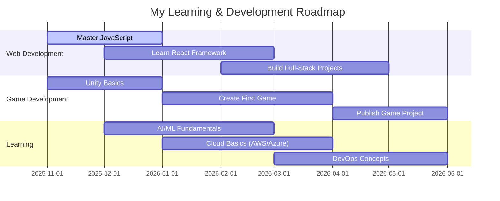

<div align="center">


<br/>


<br/>

<p align="center">
  <a href="https://github.com/abbu1809">
    
  </a>
  <a href="https://github.com/abbu1809?tab=followers">
    
  </a>
  <a href="https://github.com/abbu1809?tab=repositories">
    
  </a>
  <a href="https://linkedin.com/in/abhishekverma1809">
    
  </a>
</p>

</div>

---


##  About Me


### 👋 Hi there! I'm Abhishek Verma

> *Passionate about creating interactive web experiences and exploring the world of game development*

I'm a **3rd-year B.Tech student** at **Acropolis Institute of Technology and Research**, Madhya Pradesh, India. I love turning creative ideas into reality through code, whether it's building responsive websites or experimenting with game engines.

### 🚀 What I Do

```javascript
class AbhishekVerma extends Developer {
    constructor() {
        super();
        this.name = "Abhishek Verma";
        this.username = "abbu1809";
        this.location = "Madhya Pradesh, India 🇮🇳";
        this.portfolio = "https://abhishek-verma.vercel.app/";
        
        this.education = {
            degree: "Bachelor of Technology (B.Tech)",
            institute: "Acropolis Institute of Technology and Research",
            year: "3rd Year (5th Semester)",
            graduation: "2026"
        };
    }
    
    getCurrentRole() {
        return "Web Developer & Game Development Enthusiast";
    }
    
    getDailyRoutine() {
        return [
            "☕ Start with coffee",
            "💻 Code awesome projects",
            "🎮 Experiment with game engines",
            "📚 Learn something new",
            "🔁 Repeat"
        ];
    }
    
    getSkills() {
        return {
            languages: ["JavaScript", "C++", "C", "HTML5", "CSS3"],
            currentlyLearning: ["Unreal Engine", "Python", "AI/ML", "Cloud Tech"],
            tools: ["VS Code", "Git", "GitHub", "Figma"],
            interests: ["Web Dev", "Game Dev", "AI/ML", "Cloud", "IoT"]
        };
    }
    
    getGoals() {
        return {
            shortTerm: [
                "🎮 Master Unreal Engine fundamentals",
                "🌐 Build full-stack web applications",
                "🤖 Dive deeper into AI/ML"
            ],
            longTerm: [
                "🚀 Create immersive gaming experiences",
                "💼 Build impactful tech products",
                "🌟 Contribute to open-source community"
            ]
        };
    }
    
    getContact() {
        return {
            portfolio: "abhishek-verma.vercel.app",
            email: "abhishekkumarjaiswal9722@gmail.com",
            linkedin: "linkedin.com/in/abhishekverma1809",
            github: "github.com/abbu1809"
        };
    }
}

const me = new AbhishekVerma();
console.log("👋 Welcome to my digital playground!");
console.log("� Check out my portfolio:", me.portfolio);
```

<br clear="right"/>

<details open>
<summary><h3>🎯 Quick Overview</h3></summary>
<br/>

```yaml
👨‍💻 Name: Abhishek Verma
🎓 Education: B.Tech (3rd Year, 5th Semester)
🏫 College: Acropolis Institute of Technology and Research
📍 Location: Madhya Pradesh, India
� Portfolio: https://abhishek-verma.vercel.app/

💼 Current Role: Web Developer & Game Dev Enthusiast
🎮 Learning: Unreal Engine, AI/ML, Cloud Technologies
💻 Working On: Web Applications & Game Projects
🤝 Open For: Collaboration, Learning, Open Source

⚡ Fun Fact: I turn coffee into code and ideas into games!
🎯 Life Motto: "Learn by doing, build by creating!"
```

</details>

<details>
<summary><h3>🌟 More About Me</h3></summary>
<br/>

- � I'm currently working on **interactive web applications** and learning **Unreal Engine**
- 🌱 I'm expanding my skills in **AI/ML**, **Cloud Technologies**, and **Game Development**
- 🎮 I'm passionate about creating **immersive gaming experiences** and **user-friendly web apps**
- 👯 I'm looking to collaborate on **web projects**, **game development**, and **open-source initiatives**
- 💬 Ask me about **Web Development**, **JavaScript**, **C++**, or **Game Design**
- 📫 Reach me at: **abhishekkumarjaiswal9722@gmail.com**
- 🌐 Check out my portfolio: **[abhishek-verma.vercel.app](https://abhishek-verma.vercel.app/)**
- ⚡ I believe in **continuous learning** and **hands-on practice**

</details>

---


##  Tech Stack & Skills

<div align="center">

### 💻 Languages I Know

<p>
  
</p>

<p>
  
  
  
  
  
</p>

### 🛠️ Tools & Technologies

<p>
  
</p>

<p>
  
  
  
  
</p>

### 🌱 Currently Learning

<p>
  
</p>

<p>
  
  
  
  
</p>

### 🎮 Game Dev & Learning

<p>
  
</p>

<p>
  
  
  
  
  
</p>

</div>

---


## 📊 GitHub Statistics & Activity

<div align="center">

### 📈 Overall Performance


</div>

<div align="center">

### 💻 Language Distribution


</div>

<div align="center">

### 📈 Contribution Timeline

[](https://github.com/abbu1809)

</div>

<div align="center">

### 🏆 GitHub Achievements & Trophies


</div>

<div align="center">

### 📊 Detailed Analytics


</div>

<div align="center">

### ⏰ Coding Time & Repository Stats


</div>

<div align="center">

### 🌟 Recent Activity & Contributions

<!--START_SECTION:activity-->
<!--END_SECTION:activity-->

<sub><i>💡 Note: Stats include private repositories and all contributions</i></sub>

</div>

---


## 🎯 Learning Roadmap & Goals

<div align="center">



</div>

<details>
<summary><b>🎯 My 6-Month Goals (Nov 2025 - May 2026)</b></summary>
<br/>



</details>

<details>
<summary><b>🌱 Currently Exploring</b></summary>
<br/>

| Area | What I'm Learning | Progress |
|------|------------------|----------|
| 🌐 **Web Development** | Building responsive websites with HTML, CSS, JS | ████████░░ 80% |
| 🎮 **Game Dev** | Unity basics & game design principles | ███░░░░░░░ 30% |
| 🤖 **AI/ML** | Python for ML, basic algorithms | ██░░░░░░░░ 20% |
| ☁️ **Cloud** | Understanding cloud architecture & services | ██░░░░░░░░ 20% |
| 🔧 **DevOps** | Git, GitHub, Docker basics | ████░░░░░░ 40% |

</details>

---


## 🚀 Featured Projects & Repositories

<div align="center">

### 📌 Pinned Repositories

<!-- Automatically fetches your pinned repos -->
<a href="https://github.com/abbu1809/Abhishek1809">
  
</a>

</div>

<div align="center">

### 🎨 All My Repositories

<!-- This will show all your public repos -->


</div>

<details>
<summary><h3>💼 Project Categories</h3></summary>
<br/>

<table>
<tr>
<td width="50%" align="center">

<h4>🌐 Web Development</h4>
<p>
  <br/>
  <a href="https://abhishek-verma.vercel.app/" target="_blank">
    
  </a>
</p>
<sub>Interactive web applications, responsive designs, and modern UIs</sub>
</td>
<td width="50%" align="center">

<h4>🎮 Game Development</h4>
<p>
  <br/>
  
</p>
<sub>Experimenting with Unreal Engine, game mechanics, and interactive experiences</sub>
</td>
</tr>
<tr>
<td width="50%" align="center">

<h4>🤖 AI/ML Projects</h4>
<p>
  
</p>
<sub>Exploring machine learning algorithms and AI applications</sub>
</td>
<td width="50%" align="center">

<h4>📚 Learning Projects</h4>
<p>
  
</p>
<sub>Hands-on practice projects while mastering new technologies</sub>
</td>
</tr>
</table>

</details>

<div align="center">

### 🌟 Portfolio Highlight

<a href="https://abhishek-verma.vercel.app/" target="_blank">
  
</a>

<p>
  <sub>Check out my portfolio to see my work, projects, and journey in tech!</sub>
</p>

</div>

---


## 🌐 Let's Connect & Collaborate

<div align="center">


### � Reach Out To Me

<p>
  <a href="https://abhishek-verma.vercel.app/" target="_blank">
    
  </a>
  <a href="mailto:abhishekkumarjaiswal9722@gmail.com">
    
  </a>
  <a href="https://linkedin.com/in/abhishekverma1809" target="_blank">
    
  </a>
  <a href="https://github.com/abbu1809" target="_blank">
    
  </a>
</p>

<p>
  <a href="https://twitter.com/abbu1809" target="_blank">
    
  </a>
  <a href="https://instagram.com/abbu1809" target="_blank">
    
  </a>
  <a href="https://discord.com/users/abbu1809" target="_blank">
    
  </a>
</p>

### 💼 Professional Links

<p>
  <a href="https://leetcode.com/abbu1809" target="_blank">
    
  </a>
  <a href="https://www.hackerrank.com/abbu1809" target="_blank">
    
  </a>
  <a href="https://dev.to/abbu1809" target="_blank">
    
  </a>
</p>

</div>

<div align="center">

### 🤝 I'm Open For

<table>
<tr>
<td align="center" width="20%">
<br/>
<b>Collaboration</b><br/>
<sub>Web & Game Dev<br/>Open Source Projects</sub>
</td>
<td align="center" width="20%">
<br/>
<b>Learning Together</b><br/>
<sub>Study Groups<br/>Code Reviews</sub>
</td>
<td align="center" width="20%">
<br/>
<b>New Ideas</b><br/>
<sub>Innovative Projects<br/>Startups</sub>
</td>
<td align="center" width="20%">
<br/>
<b>Opportunities</b><br/>
<sub>Internships<br/>Freelance Work</sub>
</td>
<td align="center" width="20%">
<br/>
<b>Mentorship</b><br/>
<sub>Give & Receive<br/>Grow Together</sub>
</td>
</tr>
</table>

</div>

<details>
<summary><h3>💬 Let's Talk About...</h3></summary>
<br/>

<table>
<tr>
<td width="50%">

#### 🌐 Web Development
- Frontend Technologies (HTML, CSS, JS)
- Responsive Design & UI/UX
- Modern Web Frameworks
- Progressive Web Apps
- Web Performance Optimization

#### 🎮 Game Development
- Unreal Engine Basics
- Game Design Principles
- Game Mechanics & Physics
- Level Design
- Interactive Storytelling

</td>
<td width="50%">

#### 🤖 Emerging Technologies
- AI & Machine Learning
- Cloud Computing (AWS, Azure)
- DevOps & CI/CD
- Internet of Things (IoT)
- Blockchain & Web3

#### 📚 General Tech
- Coding Best Practices
- Problem Solving Techniques
- Career in Tech
- Learning Resources
- Student Life & Projects

</td>
</tr>
</table>

</details>

---


## 💡 More About Me & Fun Stuff

<div align="center">

### 🎯 What Drives Me

<table>
<tr>
<td align="center" width="33%">
<br/>
<b>Passion for Creating</b><br/>
<sub>Turning ideas into reality<br/>through code and creativity</sub>
</td>
<td align="center" width="33%">
<br/>
<b>Interactive Experiences</b><br/>
<sub>Building games and apps<br/>that engage and inspire</sub>
</td>
<td align="center" width="33%">
<br/>
<b>Continuous Learning</b><br/>
<sub>Always exploring<br/>new technologies</sub>
</td>
</tr>
</table>

### ⚡ Fun Facts & Interests

<table>
<tr>
<td width="50%" valign="top">

#### 🎨 Creative Side
- 🎮 **Gaming:** Strategy games, RPGs, and indie games
- 🎵 **Music:** Coding with lo-fi and electronic music
- 🎬 **Movies:** Sci-fi, tech documentaries, and animation
- � **Reading:** Tech blogs, game design books, coding tutorials

#### 💻 Coding Style
- ☕ **Fuel:** Coffee-powered developer
- 🌙 **Best Time:** Late night coding sessions
- 🎯 **Approach:** Clean code, creative solutions
- 🔍 **Debugging:** Enjoy problem-solving challenges

</td>
<td width="50%" valign="top">

#### 🌱 Learning Journey
- 📚 **Currently Reading:** Unreal Engine documentation
- 🎓 **Learning From:** YouTube, Udemy, official docs
- 🏆 **Achievements:** Building portfolio projects
- 🎯 **Next Goal:** Create a complete game prototype

#### 🌟 Philosophy
- 💡 "Every bug is a lesson in disguise"
- 🚀 "Build, break, learn, repeat"
- 🎮 "Games are interactive art forms"
- 💻 "Code is poetry with a purpose"

</td>
</tr>
</table>

### 📜 Daily Inspiration


### 🐍 Contribution Snake


<sub><i>💡 To enable this: Fork [Platane/snk](https://github.com/Platane/snk) and set up GitHub Action in your profile repo</i></sub>

### 📊 Visitor Count & GitHub Metrics

<p>
  
  
  
</p>

</div>

---

<div align="center">


### � Closing Thoughts

<table>
<tr>
<td align="center">

```javascript
function myJourney() {
    const journey = {
        started: "As a curious beginner",
        learning: "Web Dev, Game Dev, AI/ML, Cloud",
        building: "Projects that matter",
        goal: "Create impactful tech products",
        belief: "Every line of code is progress"
    };
    
    return "Keep building, keep learning, keep growing! 🚀";
}

console.log(myJourney());
```

</td>
</tr>
</table>

<p>
<i>"Every great developer started as a beginner.<br/>
Every amazing game started as an idea.<br/>
Every line of code is a step forward.<br/><br/>
<b>The journey of a thousand miles begins with a single commit.</b>"</i>
</p>

### � Get In Touch

<p>
  <b>💼 Open for opportunities, collaborations, and connections!</b><br/>
  📧 Email: <a href="mailto:abhishekkumarjaiswal9722@gmail.com">abhishekkumarjaiswal9722@gmail.com</a><br/>
  🌐 Portfolio: <a href="https://abhishek-verma.vercel.app/">abhishek-verma.vercel.app</a><br/>
  💼 LinkedIn: <a href="https://linkedin.com/in/abhishekverma1809">abhishekverma1809</a>
</p>

### 📊 Current Status

<p>
  
  
  
</p>

<p>
  
  
  
  
</p>

---

### 🎯 Quick Links

<p>
  <a href="#-about-me">About Me</a> •
  <a href="#-tech-stack--skills">Tech Stack</a> •
  <a href="#-github-statistics--activity">GitHub Stats</a> •
  <a href="#-featured-projects--repositories">Projects</a> •
  <a href="#-lets-connect--collaborate">Connect</a>
</p>

---

<sub>

**⭐ From [Abhishek Verma](https://github.com/abbu1809) • [Portfolio](https://abhishek-verma.vercel.app/)**

**🎓 B.Tech Student (3rd Year, 5th Semester)**  
**🏫 Acropolis Institute of Technology and Research**  
**📍 Madhya Pradesh, India 🇮🇳**

---

<p>
  
  
  
</p>

**Last Updated:** November 2025 | **Profile Version:** 2.0 | **Status:** Active ✅

*"Code is poetry, games are art, and learning is eternal."*

</sub>


</div>

</sub>


</div>
