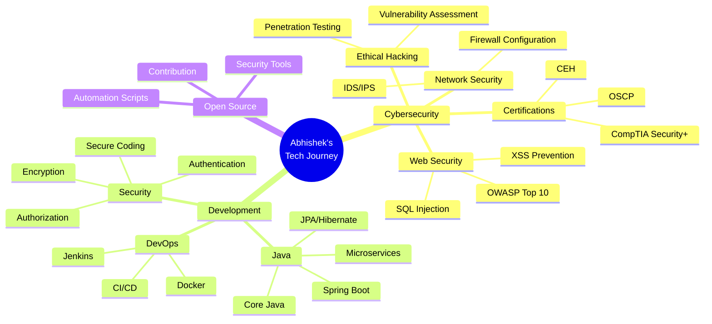
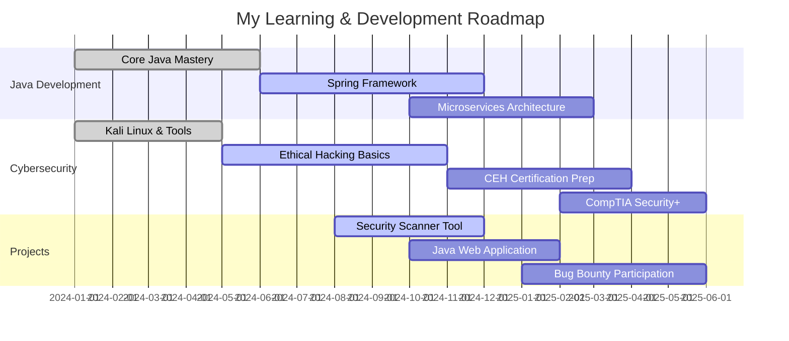

<div align="center">


<br/>


<br/>

<p align="center">
  <a href="https://github.com/abbu1809">
    
  </a>
  <a href="https://github.com/abbu1809?tab=followers">
    
  </a>
  <a href="https://github.com/abbu1809?tab=repositories">
    
  </a>
  <a href="https://github.com/abbu1809">
    
  </a>
</p>

</div>

<br/>


##  About Me


```typescript
class Abhishek extends Developer {
    constructor() {
        super();
        this.username = "abbu1809";
        this.name = "Abhishek";
        this.role = "Cybersecurity Enthusiast & Java Developer";
        this.location = "🌍 Earth";
        this.workingOn = "Mastering Java & Cybersecurity";
    }

    get skills() {
        return {
            languages: ["Java", "Python", "JavaScript", "C++", "SQL"],
            security: ["Ethical Hacking", "Network Security", "Penetration Testing"],
            interests: ["Cybersecurity 🔐", "Secure Coding 🛡️", "Bug Bounty 🐛"],
            learning: ["Advanced Java", "Spring Framework", "Security Certifications"],
            tools: ["Kali Linux", "Burp Suite", "Wireshark", "Metasploit", "Nmap"]
        };
    }

    get currentGoals() {
        return [
            "🎯 Build enterprise-level Java applications",
            "🔐 Earn cybersecurity certifications (CEH, CompTIA Security+)",
            "🌟 Contribute to open-source security projects",
            "💡 Develop custom penetration testing tools"
        ];
    }

    collaborate(project) {
        return project.type === "Cybersecurity" || 
               project.type === "Java Development" ||
               project.type === "Open Source" ? "Let's do it! 🚀" : "Let's discuss!";
    }
}

const me = new Abhishek();
console.log("Welcome to my profile! 👋");
```

<br clear="right"/>

<details open>
<summary><h3>🎯 Quick Highlights</h3></summary>
<br/>

```yaml
👨‍💻 Role: Cybersecurity Enthusiast & Developer
🔐 Passion: Breaking & Securing Systems
☕ Currently Learning: Java Development & Security
🎓 Goal: Becoming a Certified Ethical Hacker
🤝 Collaboration: Open to Cybersecurity & Java Projects
💬 Ask Me About: Java, Security, Problem Solving, Linux
⚡ Fun Fact: I debug code faster than I tie my shoes! 👟💨
🌱 Philosophy: Every bug is a lesson, every error is progress
```

</details>

---


##  Tech Stack & Arsenal

<details open>
<summary><h3>💻 Programming Languages</h3></summary>
<br/>

<p align="center">
  
</p>

<p align="center">
  
  
  
  
  
  
  
</p>

</details>

<details open>
<summary><h3>🔐 Cybersecurity & Ethical Hacking Tools</h3></summary>
<br/>

<p align="center">
  
</p>

<table align="center">
<tr>
<td align="center" width="25%">

<br/><b>Kali Linux</b>
</td>
<td align="center" width="25%">

<br/><b>Wireshark</b>
</td>
<td align="center" width="25%">

<br/><b>Metasploit</b>
</td>
<td align="center" width="25%">

<br/><b>Burp Suite</b>
</td>
</tr>
<tr>
<td align="center" width="25%">

<br/><b>Nmap</b>
</td>
<td align="center" width="25%">

<br/><b>Netcat</b>
</td>
<td align="center" width="25%">

<br/><b>John the Ripper</b>
</td>
<td align="center" width="25%">

<br/><b>SQLMap</b>
</td>
</tr>
</table>

<p align="center">
  
  
  
  
  
  
</p>

</details>

<details open>
<summary><h3>🚀 Frameworks, Libraries & Technologies</h3></summary>
<br/>

<p align="center">
  
</p>

<p align="center">
  
  
  
  
  
  
  
  
</p>

</details>

<details open>
<summary><h3>🗄️ Databases & Cloud</h3></summary>
<br/>

<p align="center">
  
</p>

<p align="center">
  
  
  
  
  
</p>

</details>

<details open>
<summary><h3>🧰 Development Tools & IDEs</h3></summary>
<br/>

<p align="center">
  
</p>

<p align="center">
  
  
  
  
  
  
</p>

</details>

---


## 📊 GitHub Statistics & Analytics

<div align="center">

### 📈 Overall Stats

 


</div>

<div align="center">

### 💻 Most Used Languages


</div>

<div align="center">

### 📊 Contribution Graph

[](https://github.com/abbu1809)

</div>

<div align="center">
  
### 🏆 GitHub Trophies


</div>

<div align="center">

### 📊 Profile Summary Card


</div>

<div align="center">

### ⚡ Recent Activity


</div>

---


## 🎯 Learning Journey & Goals

<div align="center">



</div>

<details>
<summary><h3>🎯 2024-25 Goals & Roadmap</h3></summary>
<br/>



</details>

<details>
<summary><h3>🌱 Currently Learning</h3></summary>
<br/>

<table>
<tr>
<td width="50%">

#### Java Development
- ☕ Advanced Java Concepts
- 🌱 Spring Boot Framework
- 🏗️ Design Patterns
- 🔄 RESTful APIs
- 🗄️ Database Management
- 🧪 Unit Testing (JUnit)

</td>
<td width="50%">

#### Cybersecurity
- 🔐 Ethical Hacking Techniques
- 🌐 Network Security Fundamentals
- 🕷️ Web Application Security
- 🔍 Penetration Testing
- 🛡️ Secure Coding Practices
- 📜 Security Certifications

</td>
</tr>
</table>

</details>

---


## 🚀 Featured Projects & Work

<div align="center">

<table>
<tr>
<td width="50%">
<h3 align="center">🔐 Security Projects</h3>
<div align="center">  
<a href="https://github.com/abbu1809?tab=repositories&q=security">

</a>
<p><strong>🛡️ Security Tools & Scripts</strong> - Custom security automation tools and ethical hacking scripts</p>
</div>
</td>
<td width="50%">
<h3 align="center">☕ Java Projects</h3>
<div align="center">  
<a href="https://github.com/abbu1809?tab=repositories&q=java">

</a>
<p><strong>☕ Java Applications</strong> - Full-stack Java applications with Spring Boot</p>
</div>
</td>
</tr>
</table>

### 🌟 What I'm Working On

```python
current_projects = {
    "🔐 Security Scanner": {
        "status": "In Progress",
        "tech": ["Python", "Nmap", "Scapy"],
        "description": "Automated vulnerability scanner for web applications"
    },
    "☕ Spring Boot API": {
        "status": "In Progress",
        "tech": ["Java", "Spring Boot", "MySQL", "Docker"],
        "description": "RESTful API with JWT authentication and role-based access"
    },
    "📚 Learning Projects": {
        "status": "Ongoing",
        "tech": ["Various"],
        "description": "Hands-on projects while learning new technologies"
    }
}

for project, details in current_projects.items():
    print(f"{project}: {details['status']} - {details['description']}")
```

</div>

---


## 🌐 Connect & Collaborate

<div align="center">

### 📱 Social Media & Professional Platforms

<p>
  <a href="https://linkedin.com/in/yourprofile">
    
  </a>
  <a href="https://twitter.com/yourprofile">
    
  </a>
  <a href="mailto:your.email@example.com">
    
  </a>
  <a href="https://discord.gg/yourserver">
    
  </a>
</p>

<p>
  <a href="https://yourportfolio.com">
    
  </a>
  <a href="https://hackerrank.com/yourprofile">
    
  </a>
  <a href="https://leetcode.com/yourprofile">
    
  </a>
  <a href="https://dev.to/yourprofile">
    
  </a>
</p>

### 💼 Open to Opportunities

<table>
<tr>
<td align="center">🤝 <b>Collaboration</b></td>
<td align="center">💡 <b>Freelance</b></td>
<td align="center">🎓 <b>Mentorship</b></td>
<td align="center">🚀 <b>Internships</b></td>
</tr>
<tr>
<td align="center">Cybersecurity<br/>Java Projects<br/>Open Source</td>
<td align="center">Web Development<br/>Security Audits<br/>Code Review</td>
<td align="center">Learning Together<br/>Code Review<br/>Best Practices</td>
<td align="center">Security Roles<br/>Development<br/>Research</td>
</tr>
</table>

</div>

---


## 💡 Inspiration & Extras

<div align="center">

### 📜 Random Dev Quote


### 🐍 Contribution Snake


### 🎵 Spotify Playing

[](https://open.spotify.com/user/yourspotifyid)

### 💭 Quote of the Day
  
*"The only way to do great work is to love what you do."* - Steve Jobs

### ⚡ Fun Facts About Me

<table>
<tr>
<td align="center">🔐</td>
<td><b>Breaking and securing systems</b> - The best way to protect is to understand how to attack!</td>
</tr>
<tr>
<td align="center">📚</td>
<td><b>Reading cybersecurity blogs daily</b> - Staying updated with the latest vulnerabilities and exploits</td>
</tr>
<tr>
<td align="center">🎵</td>
<td><b>Coding with music</b> - Lo-fi beats and programming go hand in hand</td>
</tr>
<tr>
<td align="center">🎯</td>
<td><b>Problem-solving addict</b> - HackerRank, LeetCode, and CTF challenges are my playground</td>
</tr>
<tr>
<td align="center">🌱</td>
<td><b>Lifelong learner</b> - Every bug is a lesson, every error is progress</td>
</tr>
<tr>
<td align="center">☕</td>
<td><b>Coffee-powered developer</b> - Converting caffeine into code since day one!</td>
</tr>
</table>

### 🎮 When I'm Not Coding

<p align="center">
  🔐 Practicing on HackTheBox & TryHackMe | 
  📖 Reading tech blogs & documentation | 
  🎵 Discovering new music | 
  🎯 Solving coding challenges | 
  🌐 Contributing to open source | 
  🎓 Taking online courses
</p>

</div>

---


## 📫 Get In Touch

<div align="center">

```javascript
const contactMe = {
    email: "your.email@example.com",
    linkedin: "linkedin.com/in/yourprofile",
    twitter: "@yourhandle",
    discord: "YourDiscord#1234",
    
    availability: {
        collaboration: "✅ Open",
        freelance: "✅ Available",
        fullTime: "🔍 Looking",
        mentorship: "✅ Happy to help"
    },
    
    preferredContact: "Email or LinkedIn",
    responseTime: "Within 24 hours",
    
    message: "💼 Open to collaboration on Cybersecurity Projects and Java Development\n" +
             "📧 Feel free to reach out for projects, discussions, or just a chat about tech!\n" +
             "🌟 Don't forget to check out my repositories and drop a ⭐ if you find something interesting!"
};

console.log("Let's connect and build something amazing together! 🚀");
```

### 📊 Weekly Development Breakdown

<!--START_SECTION:waka-->
<!--END_SECTION:waka-->

<sub><i>💡 Tip: To enable WakaTime stats, set up the WakaTime GitHub Action in your profile repository!</i></sub>

</div>

---

<div align="center">


### 🙏 Thanks for visiting my profile!

<p>
  
  
  
</p>

**⭐ From [abbu1809](https://github.com/abbu1809) with 💙**

*Last Updated: November 2025 • Built with passion for cybersecurity and code*


</div>
