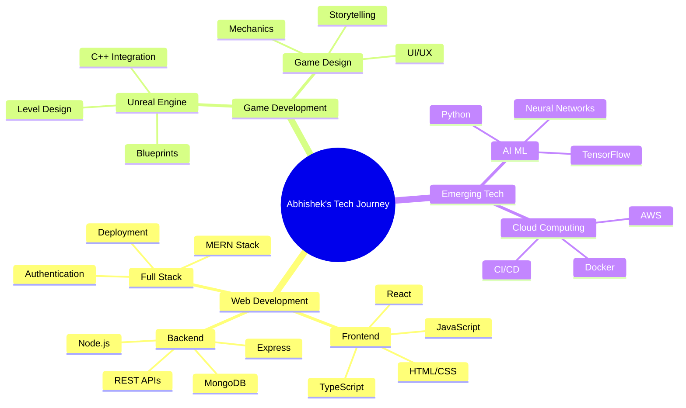
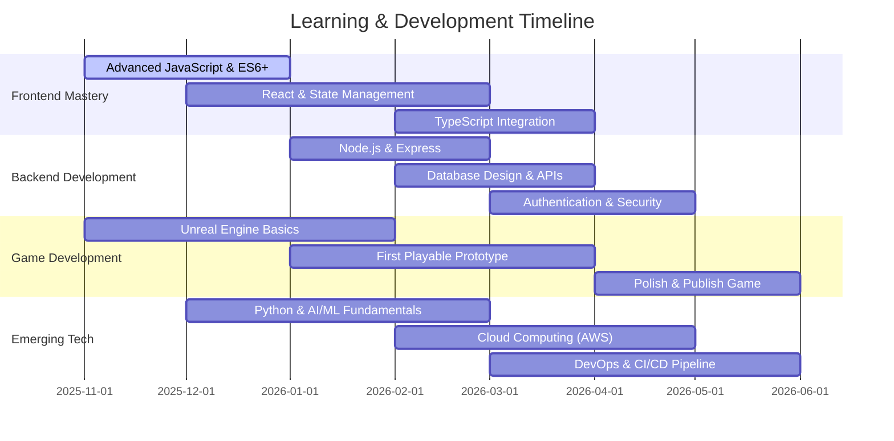

<div align="center">


<br/>


<br/>

<p align="center">
  <a href="https://github.com/abbu1809">
    
  </a>
  <a href="https://github.com/abbu1809?tab=followers">
    
  </a>
  <a href="https://github.com/abbu1809?tab=repositories">
    
  </a>
  <a href="https://linkedin.com/in/abhishekverma1809">
    
  </a>
</p>

</div>

---


##  About Me


### 👋 Hi there! I'm Abhishek Verma

> *"Code is my canvas, games are my art, and innovation is my passion"*

I'm a **passionate developer** and **3rd-year B.Tech student** at **Acropolis Institute of Technology and Research**, Madhya Pradesh, India 🇮🇳. With a strong foundation in **web development** and a growing interest in **game development**, I'm on a mission to create immersive digital experiences that make a difference.

**🎯 Current Focus:** Mastering full-stack web development while diving deep into Unreal Engine and AI/ML technologies.

### 🚀 What I Do

```typescript
interface Developer {
    name: string;
    role: string;
    skills: string[];
    learning: string[];
    goals: string[];
}

const abhishek: Developer = {
    name: "Abhishek Verma",
    role: "Full-Stack Developer & Game Dev Enthusiast",
    skills: [
        "💻 Web Development (HTML, CSS, JavaScript)",
        "🎮 Game Development (Unreal Engine)",
        "� Problem Solving (C++, Data Structures)",
        "🎨 UI/UX Design (Figma)",
        "🔗 Version Control (Git, GitHub)"
    ],
    learning: [
        "🐍 Python & AI/ML",
        "☁️ Cloud Technologies (AWS, Azure)",
        "⚛️ React & Node.js",
        "� Advanced Game Development",
        "🤖 Machine Learning Algorithms"
    ],
    goals: [
        "🚀 Build production-ready web applications",
        "🎮 Launch my first indie game",
        "🌟 Contribute to major open-source projects",
        "💼 Secure a tech internship at top companies"
    ]
};

console.log(`👋 Hey! I'm ${abhishek.name}`);
console.log(`🎯 Mission: Transform ideas into interactive experiences`);
console.log(`� Based in Madhya Pradesh, India`);
console.log(`🌐 Portfolio: abhishek-verma.vercel.app`);
```

<br clear="right"/>

### 📊 Professional Snapshot

<table>
<tr>
<td width="50%" valign="top">

#### 💼 Current Status
- 🎓 **B.Tech Student** - 3rd Year (5th Semester)
- 🏫 **Acropolis Institute of Technology and Research**
- 📍 **Madhya Pradesh, India** 🇮🇳
- 🎯 **Graduation:** 2027
- 🌐 **Portfolio:** [abhishek-verma.vercel.app](https://abhishek-verma.vercel.app/)

#### � What I'm Up To
- 💻 Building **full-stack web applications**
- 🎮 Learning **Unreal Engine** & game development
- 🤖 Exploring **AI/ML** with Python
- ☁️ Diving into **Cloud Technologies**
- � Contributing to **open-source projects**

</td>
<td width="50%" valign="top">

#### 🎯 Core Competencies
```yaml
Languages: JavaScript, C++, C, HTML5, CSS3
Frameworks: Learning React, Node.js
Tools: VS Code, Git, GitHub, Figma
Databases: MySQL, MongoDB (Learning)
Currently Exploring: Python, AI/ML, Cloud
Game Engines: Unreal Engine, Unity
```

#### 🤝 Open For
- � **Internship Opportunities**
- 🤝 **Project Collaborations**
- 🌟 **Open Source Contributions**
- 📚 **Tech Discussions & Mentorship**

</td>
</tr>
</table>

---


##  Tech Stack & Skills

<div align="center">

### 💻 Core Technologies

<p>
  
</p>

### 🎮 Game Development Stack

<p>
  
</p>

### ☁️ Learning & Exploring

<p>
  
</p>

### 🛠️ Tech Proficiency

<table>
<tr>
<td width="33%" align="center">
<h4>⚡ Frontend</h4>


</td>
<td width="33%" align="center">
<h4>⚙️ Backend</h4>


</td>
<td width="33%" align="center">
<h4>� Game Dev</h4>


</td>
</tr>
<tr>
<td width="33%" align="center">
<h4>🤖 AI/ML</h4>


</td>
<td width="33%" align="center">
<h4>☁️ Cloud & DevOps</h4>


</td>
<td width="33%" align="center">
<h4>🛠️ Tools</h4>


</td>
</tr>
</table>

</div>

---


## 📊 GitHub Statistics & Analytics

<div align="center">

### 📈 Performance Overview

<a href="https://github.com/abbu1809">
  
</a>
<a href="https://github.com/abbu1809">
  
</a>

### 💻 Language & Activity Distribution

<a href="https://github.com/abbu1809">
  
</a>
<a href="https://github.com/abbu1809">
  
</a>

### 📊 Detailed Contribution Analytics

<a href="https://github.com/abbu1809">
  
</a>

### 📈 Repository & Language Metrics

<a href="https://github.com/abbu1809?tab=repositories">
  
</a>
<a href="https://github.com/abbu1809?tab=repositories">
  
</a>

### 🏆 GitHub Achievements & Trophies

<a href="https://github.com/abbu1809">
  
</a>

### 🎖️ GitHub Badges & Achievements

<a href="https://holopin.io/@abbu1809">
  
</a>

<details>
<summary><b>🔥 More GitHub Metrics</b></summary>
<br/>


</details>

<sub><i>💡 Note: Stats include private repositories and all contributions</i></sub>

</div>

---


## 🎯 Learning Roadmap & Goals

<div align="center">



**Legend:** ✅ Proficient | 🔄 Learning | 📚 Planned

</div>

<details>
<summary><b>🗓️ 6-Month Development Roadmap (Nov 2025 - May 2026)</b></summary>
<br/>



</details>

<details>
<summary><b>📊 Current Learning Progress</b></summary>
<br/>

| 🎯 Skill Area | 📚 Focus | 📈 Progress | 🎯 Target |
|--------------|----------|------------|-----------|
| **🌐 Web Dev** | Full-Stack Development |  | Expert Level |
| **🎮 Game Dev** | Unreal Engine & C++ |  | First Game Launch |
| **🤖 AI/ML** | Python & TensorFlow |  | ML Projects |
| **☁️ Cloud** | AWS & Docker |  | Certification |
| **🔧 DevOps** | Git, CI/CD, Docker |  | Production Ready |
| **⚛️ React** | Components & Hooks |  | Advanced Patterns |

</details>

<details>
<summary><b>🎯 2026 Goals & Milestones</b></summary>
<br/>

### 🚀 Short-Term Goals (Next 3 Months)
- ✅ Complete 5 full-stack web projects
- 🔄 Build first playable game prototype
- 📚 Learn React & Node.js ecosystem
- 💼 Secure a tech internship
- 🌟 Contribute to 3 open-source projects

### 🌟 Long-Term Vision (6-12 Months)
- 🎮 Launch first indie game on Steam/Itch.io
- 🌐 Deploy 3 production-ready web applications
- 🤖 Complete AI/ML specialization course
- ☁️ Earn AWS Cloud Practitioner certification
- 💼 Land a full-time developer role post-graduation

</details>

---


## 🚀 Featured Projects & Portfolio

<div align="center">

### 🌟 Portfolio Showcase

<a href="https://abhishek-verma.vercel.app/" target="_blank">
  
</a>

<p>
  <sub>✨ Explore my complete portfolio with live projects, case studies, and tech journey!</sub>
</p>

### 📌 Featured Repositories

<a href="https://github.com/abbu1809/Abhishek1809">
  
</a>

</div>

<details>
<summary><h3>💼 Project Categories</h3></summary>
<br/>

<table>
<tr>
<td width="50%" align="center">

<h4>🌐 Web Development</h4>
<p>
  
  
</p>
<sub>Full-stack applications, responsive designs, and modern web experiences</sub>
</td>
<td width="50%" align="center">

<h4>🎮 Game Development</h4>
<p>
  
  
</p>
<sub>Game prototypes, mechanics, and interactive 3D experiences</sub>
</td>
</tr>
<tr>
<td width="50%" align="center">

<h4>🤖 AI/ML Experiments</h4>
<p>
  
  
</p>
<sub>Machine learning models and AI-powered applications</sub>
</td>
<td width="50%" align="center">

<h4>📚 Learning Projects</h4>
<p>
  
  
</p>
<sub>Practice projects while mastering new technologies</sub>
</td>
</tr>
</table>

</details>

---


## 🌐 Connect With Me

<div align="center">


### 📫 Get In Touch

<p>
  <a href="https://abhishek-verma.vercel.app/" target="_blank">
    
  </a>
  <a href="mailto:abhishekkumarjaiswal9722@gmail.com">
    
  </a>
  <a href="https://linkedin.com/in/abhishekverma1809" target="_blank">
    
  </a>
  <a href="https://github.com/abbu1809" target="_blank">
    
  </a>
  <a href="https://twitter.com/abbu1809" target="_blank">
    
  </a>
</p>

### 💻 Coding Platforms

<p>
  <a href="https://leetcode.com/abbu1809" target="_blank">
    
  </a>
  <a href="https://www.hackerrank.com/abbu1809" target="_blank">
    
  </a>
  <a href="https://dev.to/abbu1809" target="_blank">
    
  </a>
  <a href="https://stackoverflow.com/users/abbu1809" target="_blank">
    
  </a>
</p>

### 📊 Profile Analytics

<p>
  
  
  
</p>

</div>

<div align="center">

### 🤝 Open For Collaboration

<table>
<tr>
<td align="center" width="25%">
<br/>
<b>Project Collaboration</b><br/>
<sub>Web & Game Dev<br/>Open Source</sub>
</td>
<td align="center" width="25%">
<br/>
<b>Internships</b><br/>
<sub>Full-time or Part-time<br/>Remote Opportunities</sub>
</td>
<td align="center" width="25%">
<br/>
<b>Innovation</b><br/>
<sub>Startup Ideas<br/>Tech Solutions</sub>
</td>
<td align="center" width="25%">
<br/>
<b>Mentorship</b><br/>
<sub>Learning & Growing<br/>Knowledge Sharing</sub>
</td>
</tr>
</table>

</div>

---


## 🎯 What Drives Me

<div align="center">

<table>
<tr>
<td align="center" width="33%">
<br/>
<b>💡 Passion for Creating</b><br/>
<sub>Turning ideas into reality through code and creativity</sub>
</td>
<td align="center" width="33%">
<br/>
<b>🎮 Interactive Experiences</b><br/>
<sub>Building games and apps that engage and inspire</sub>
</td>
<td align="center" width="33%">
<br/>
<b>🚀 Continuous Learning</b><br/>
<sub>Always exploring new technologies and frameworks</sub>
</td>
</tr>
</table>

### � Random Dev Quote


### 😂 Random Dev Meme


### 🎲 Random Dev Joke


### 🐍 Contribution Snake

<picture>
  <source media="(prefers-color-scheme: dark)" srcset="https://raw.githubusercontent.com/abbu1809/abbu1809/output/github-snake-dark.svg">
  <source media="(prefers-color-scheme: light)" srcset="https://raw.githubusercontent.com/abbu1809/abbu1809/output/github-snake.svg">
  
</picture>

<sub><i>💡 Watch the snake eat my contributions! Auto-generated by [Platane/snk](https://github.com/Platane/snk)</i></sub>

### 🎵 Spotify Now Playing

[](https://open.spotify.com/user/31l5lpd4oc4pu5dfhkqzfvuadccy)

### 🎮 Interactive Stats

<details>
<summary><b>⚡ Recent GitHub Activity</b></summary>
<br/>

<!--START_SECTION:activity-->
<!--END_SECTION:activity-->

</details>

### 🔥 Contribution Heatmap


### 📈 Detailed Contribution Graph

[](https://github.com/abbu1809)

</div>

---

<div align="center">


### 💭 Developer's Mindset

```typescript
const developerJourney = {
    started: "With curiosity and determination",
    learning: ["Web Dev", "Game Dev", "AI/ML", "Cloud"],
    building: "Projects that create impact",
    goal: "Transform ideas into reality",
    motto: "Every bug is a lesson, every project is growth"
};

// The journey continues... 🚀
console.log("Keep coding, keep creating, keep inspiring!");
```

### 📬 Quick Contact

<table>
<tr>
<td align="center">
📧 <b>Email</b><br/>
<a href="mailto:abhishekkumarjaiswal9722@gmail.com">abhishekkumarjaiswal9722@gmail.com</a>
</td>
<td align="center">
🌐 <b>Portfolio</b><br/>
<a href="https://abhishek-verma.vercel.app/">abhishek-verma.vercel.app</a>
</td>
<td align="center">
💼 <b>LinkedIn</b><br/>
<a href="https://linkedin.com/in/abhishekverma1809">abhishekverma1809</a>
</td>
</tr>
</table>

### 📊 Current Status

<p>
  
  
  
</p>

---

### 🎯 Navigation

<p>
  <a href="#-about-me">👨‍💻 About</a> •
  <a href="#-tech-stack--skills">🛠️ Skills</a> •
  <a href="#-github-statistics--analytics">📊 Stats</a> •
  <a href="#-learning-roadmap--goals">🎯 Roadmap</a> •
  <a href="#-featured-projects--portfolio">🚀 Projects</a> •
  <a href="#-connect-with-me">🌐 Connect</a>
</p>

---

<sub>

**⭐ Created by [Abhishek Verma](https://github.com/abbu1809) | [Portfolio](https://abhishek-verma.vercel.app/)**

🎓 B.Tech Student • 🏫 Acropolis Institute of Technology and Research • 📍 Madhya Pradesh, India 🇮🇳

<p>
  
  
  
</p>

*"Code is poetry, games are art, and learning is eternal." 🚀*

</sub>


</div>
