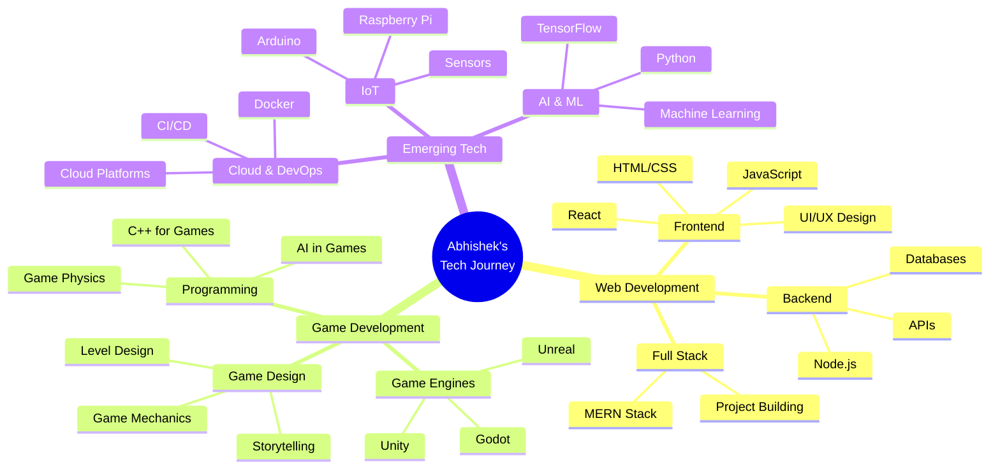
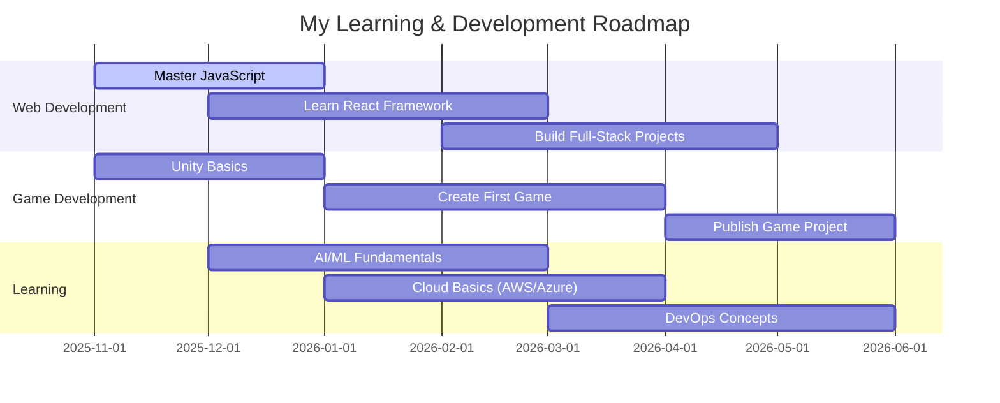

<div align="center">


<br/>


<br/>

<p align="center">
  <a href="https://github.com/abbu1809">
    
  </a>
  <a href="https://github.com/abbu1809?tab=followers">
    
  </a>
  <a href="https://github.com/abbu1809?tab=repositories">
    
  </a>
  <a href="https://linkedin.com/in/abhishekverma1809">
    
  </a>
</p>

</div>

---


##  About Me


```javascript
const abhishekVerma = {
    fullName: "Abhishek Verma",
    username: "abbu1809",
    location: "Madhya Pradesh, India 🇮🇳",
    education: {
        degree: "B.Tech (Bachelor of Technology)",
        college: "Acropolis Institute of Technology and Research",
        year: "3rd Year",
        semester: "5th Semester"
    },
    role: "Web Developer & Game Dev Enthusiast",
    
    currentFocus: [
        "🌐 Building responsive web applications",
        "🎮 Exploring game development",
        "🤖 Learning AI/ML fundamentals",
        "☁️ Understanding DevOps & Cloud"
    ],
    
    interests: [
        "Web Development 💻",
        "Game Development 🎮",
        "AI & Machine Learning 🤖",
        "Cloud Computing ☁️",
        "IoT Projects 📡"
    ],
    
    contactMe: {
        email: "abhishekkumarjaiswal9722@gmail.com",
        linkedin: "linkedin.com/in/abhishekverma1809",
        github: "github.com/abbu1809"
    },
    
    lifePhilosophy: "Learn by doing, build by creating! 🚀"
};

console.log("Welcome to my digital playground! 🎨");
```

<br clear="right"/>

<details open>
<summary><b>🎯 Quick Stats</b></summary>
<br/>

```yaml
🎓 Student: 3rd Year B.Tech, 5th Semester
💻 Primary Focus: Web Development
🎮 Passion: Game Development
🌱 Currently Learning: AI/ML, Cloud Technologies
🏫 College: Acropolis Institute of Technology and Research
📍 Location: Madhya Pradesh, India
🤝 Open to: Collaboration, Learning, New Projects
⚡ Fun Fact: I turn ideas into interactive experiences!
```

</details>

---


##  Tech Stack & Skills

<div align="center">

### 💻 Languages I Know

<p>
  
</p>

<p>
  
  
  
  
  
</p>

### 🛠️ Tools & Technologies

<p>
  
</p>

<p>
  
  
  
  
</p>

### 🌱 Currently Learning

<p>
  
</p>

<p>
  
  
  
  
</p>

### 🎮 Game Dev Interests

<p>
  
  
  
  
</p>

</div>

---


## 📊 GitHub Statistics & Activity

<div align="center">


</div>

<div align="center">

### 📈 Contribution Graph

[](https://github.com/abbu1809)

</div>

<div align="center">

### 🏆 GitHub Achievements


</div>

<div align="center">

### 📊 Detailed Profile Stats


</div>

---


## 🎯 Learning Roadmap & Goals

<div align="center">



</div>

<details>
<summary><b>🎯 My 6-Month Goals (Nov 2025 - May 2026)</b></summary>
<br/>



</details>

<details>
<summary><b>🌱 Currently Exploring</b></summary>
<br/>

| Area | What I'm Learning | Progress |
|------|------------------|----------|
| 🌐 **Web Development** | Building responsive websites with HTML, CSS, JS | ████████░░ 80% |
| 🎮 **Game Dev** | Unity basics & game design principles | ███░░░░░░░ 30% |
| 🤖 **AI/ML** | Python for ML, basic algorithms | ██░░░░░░░░ 20% |
| ☁️ **Cloud** | Understanding cloud architecture & services | ██░░░░░░░░ 20% |
| 🔧 **DevOps** | Git, GitHub, Docker basics | ████░░░░░░ 40% |

</details>

---


## 🚀 My Projects

<div align="center">

### 🎨 Featured Work

> *Building my portfolio one project at a time!*

<table>
<tr>
<td width="50%" align="center">

<h3>🌐 Web Projects</h3>
<p><i>Coming Soon...</i></p>
<p>Working on interactive web applications</p>
</td>
<td width="50%" align="center">

<h3>🎮 Game Projects</h3>
<p><i>In Development...</i></p>
<p>Experimenting with game engines and mechanics</p>
</td>
</tr>
</table>

### 📚 Learning Projects

<p align="center">
  <i>🔨 Building hands-on projects while learning new technologies</i><br/>
  <i>📖 Following tutorials and creating my own variations</i><br/>
  <i>💡 Experimenting with ideas and turning them into code</i>
</p>

</div>

---


## 🌐 Connect With Me

<div align="center">

### 📱 Let's Connect & Collaborate!

<p>
  <a href="mailto:abhishekkumarjaiswal9722@gmail.com">
    
  </a>
  <a href="https://linkedin.com/in/abhishekverma1809">
    
  </a>
  <a href="https://github.com/abbu1809">
    
  </a>
</p>

### 🤝 Open For

<table>
<tr>
<td align="center" width="25%">
<br/>
<b>Collaboration</b><br/>
<sub>Web & Game Projects</sub>
</td>
<td align="center" width="25%">
<br/>
<b>Learning Together</b><br/>
<sub>Study Buddies Welcome</sub>
</td>
<td align="center" width="25%">
<br/>
<b>New Ideas</b><br/>
<sub>Let's Build Something</sub>
</td>
<td align="center" width="25%">
<br/>
<b>Mentorship</b><br/>
<sub>Learn & Grow Together</sub>
</td>
</tr>
</table>

</div>

---


## 💡 More About Me

<div align="center">

### 🎯 What Drives Me

<table>
<tr>
<td align="center" width="33%">
<br/>
<b>Passion for Creating</b><br/>
<sub>I love turning ideas into reality through code</sub>
</td>
<td align="center" width="33%">
<br/>
<b>Interactive Experiences</b><br/>
<sub>Games and web apps that engage users</sub>
</td>
<td align="center" width="33%">
<br/>
<b>Continuous Learning</b><br/>
<sub>Always exploring new technologies</sub>
</td>
</tr>
</table>

### 📜 Random Dev Quote


### 🐍 Watch My Contributions


<sub><i>💡 To enable snake animation: Fork [Platane/snk](https://github.com/Platane/snk) and set up GitHub Action</i></sub>

### ⚡ Fun Facts

<p align="left">
  🎮 <b>Gaming:</b> I believe games are the future of interactive storytelling<br/>
  💻 <b>Coding Style:</b> Clean code with creative solutions<br/>
  🌱 <b>Learning Approach:</b> Hands-on practice and building projects<br/>
  🎨 <b>Creative Side:</b> Love designing user interfaces and game mechanics<br/>
  📚 <b>Always Curious:</b> If it involves tech, I want to learn it!<br/>
  🚀 <b>Future Goal:</b> Create games and applications that make a difference<br/>
</p>

</div>

---

<div align="center">


### 💭 Final Thoughts

<p>
<i>"Every great developer started as a beginner.<br/>
Every amazing game started as an idea.<br/>
Every line of code is a step forward."</i>
</p>

### 📊 Profile Stats

<p>
  
  
  
</p>

---

<sub>
  
**✨ Made with 💙 by [Abhishek Verma](https://github.com/abbu1809)**

*3rd Year B.Tech Student | Acropolis Institute of Technology and Research*

*Madhya Pradesh, India 🇮🇳*

**Last Updated:** November 2025

</sub>


</div>
