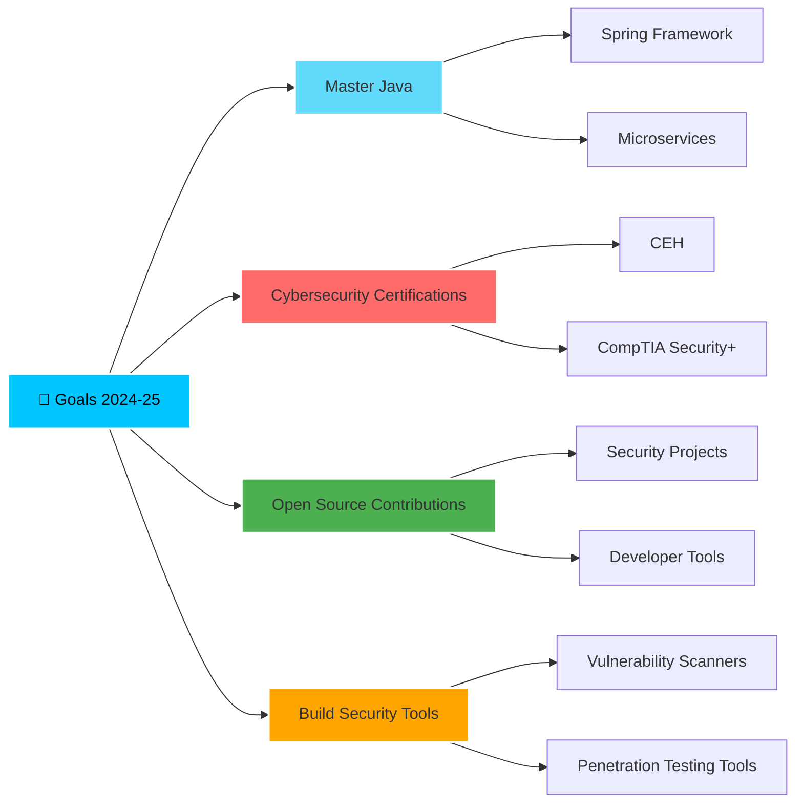

<div align="center">
  
# � Welcome to Abhishek's Digital Universe 🌌


[](https://github.com/abbu1809)
[](https://github.com/abbu1809?tab=followers)
[](https://github.com/abbu1809?tab=repositories)

</div>

---

## 🎯 About Me

```javascript
const abhishek = {
    username: "abbu1809",
    role: "Cybersecurity Enthusiast & Developer",
    currentFocus: "Java Development & Security",
    interests: ["Cybersecurity 🔐", "Ethical Hacking 💻", "Secure Coding 🛡️"],
    learningGoals: ["Advanced Java", "Network Security", "Penetration Testing"],
    collaborateOn: "Cybersecurity Projects & Open Source",
    askMeAbout: ["Java", "Security", "Problem Solving"],
    funFact: "I debug code faster than I can tie my shoes! 👟💨"
};
```

<div align="center">
  
### 🌟 Quick Highlights
  
🔒 **Cybersecurity Passionate** | ☕ **Java Developer** | 🎓 **Continuous Learner** | 🤝 **Open to Collaborate**

</div>

---

## �️ Tech Stack & Skills

<div align="center">

### 💻 Programming Languages


### 🔐 Cybersecurity Tools


### � Frameworks & Technologies


### 🧰 Development Tools


</div>

---

## 📊 GitHub Statistics

<div align="center">
  
 


</div>

<div align="center">
  
### 🏆 GitHub Trophies


</div>

---

## 🎯 Current Focus

<div align="center">


```mermaid
graph LR
    A[🎯 Goals 2024-25] --> B[Master Java]
    A --> C[Cybersecurity Certifications]
    A --> D[Open Source Contributions]
    A --> E[Build Security Tools]
    
    B --> F[Spring Framework]
    B --> G[Microservices]
    
    C --> H[CEH]
    C --> I[CompTIA Security+]
    
    D --> J[Security Projects]
    D --> K[Developer Tools]
    
    E --> L[Vulnerability Scanners]
    E --> M[Penetration Testing Tools]
    
    style A fill:#00C7FF,stroke:#fff,stroke-width:2px,color:#000
    style B fill:#61DAFB,stroke:#fff,stroke-width:2px
    style C fill:#FF6B6B,stroke:#fff,stroke-width:2px
    style D fill:#4CAF50,stroke:#fff,stroke-width:2px
    style E fill:#FFA500,stroke:#fff,stroke-width:2px
```

</div>

---

## 🚀 Featured Projects

<div align="center">

<a href="https://github.com/abbu1809?tab=repositories">
  
</a>

</div>

---

## 🌐 Connect With Me

<div align="center">
  
[](https://linkedin.com/in/yourprofile)
[](https://twitter.com/yourprofile)
[](https://discord.gg/yourserver)
[](mailto:your.email@example.com)
[](https://yourportfolio.com)
[](https://hackerrank.com/yourprofile)
[](https://leetcode.com/yourprofile)

</div>

---

## 💡 Random Dev Quote

<div align="center">


</div>

---

## 🐍 Contribution Snake

<div align="center">
  


</div>

---

## 📈 Contribution Graph

<div align="center">

[](https://github.com/abbu1809)

</div>

---

## 💻 Coding Activity

<div align="center">

<!--START_SECTION:waka-->
<!--END_SECTION:waka-->

</div>

---

<div align="center">
  
### 💭 Quote of the Day
  
*"The only way to do great work is to love what you do."* - Steve Jobs


### ⚡ Fun Fact
🎯 I believe in learning by doing - Every bug is a lesson, every error is progress!

---

### 🎮 When I'm Not Coding

🔐 Breaking and securing systems | 📚 Reading cybersecurity blogs | 🎵 Listening to music | 🎯 Problem solving on coding platforms

---


### 📫 How to Reach Me

💼 Open to collaboration on **Cybersecurity Projects** and **Java Development**  
📧 Feel free to reach out for projects, discussions, or just a chat about tech!  
🌟 Don't forget to check out my repositories and drop a ⭐ if you find something interesting!

---

<div align="center">
  
**⭐ From [abbu1809](https://github.com/abbu1809) with 💙**

*Last Updated: November 2025*

</div>

</div>
